# QuickSight ハンズオン


## 1 ハンズオンの構成
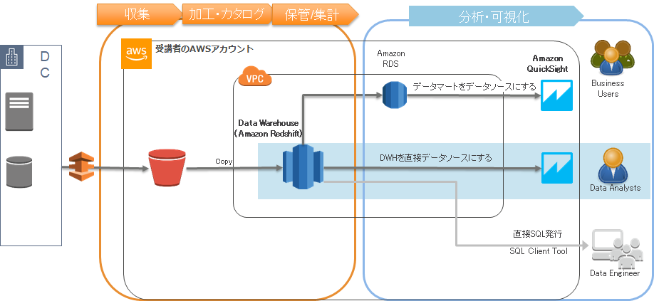


## 2 ハンズオンのデータ

次のデータがRedshiftにロードされています。

ファクトデータ
- Sales

ディメンジョンデータ
- channels
- countries
- customers
- products
- promotions
- times

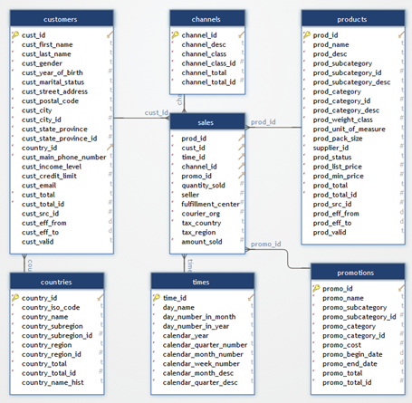


## 3 QuickSight 初期設定

#### 3.1 QuickSight のマネジメントコンソールを開く
別サイトが開くので注意
初めて利用する際は，Sign up のガイドに従って順に入力していく
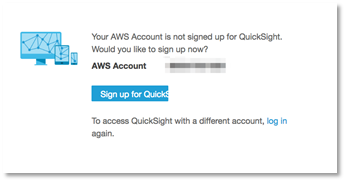

#### 3.2 [Enterprise edition] を選択して [Continue] を押す
VPC内のデータソースに接続するために Enterprise機能が必要です
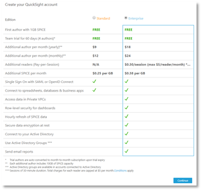

#### 3.3  以下を入力して[Finish] を押す
リージョンを間違えないように注意ください

-  Role Based Federation(SSO)  : チェック 
- QuickSight region     : Asia Pacific (Tokyo) 
-  QuickSight account name     : Handson-アカウントID 
- Notification email address      : ご自身のメールアドレス 
- チェックボックスは以下をチェック（それ以外のチェックは任意）
 - |Enable autodiscovery of data and users in your Amazon Redshift, Amazon RDS, and AWS IAM services.


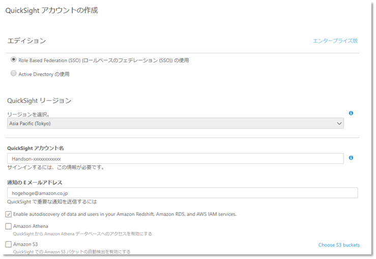

#### 3.4 つぎが表示されたら　「Amazon QuickSightに移動する」を押して完了です。
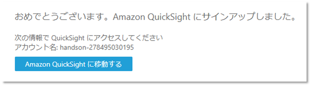


####  3.5  QuickSight 初期画面
これで初期設定ができました
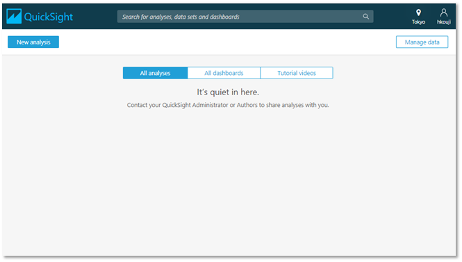


## 4  データセットを準備

#### 4.1 New analysis を押してください
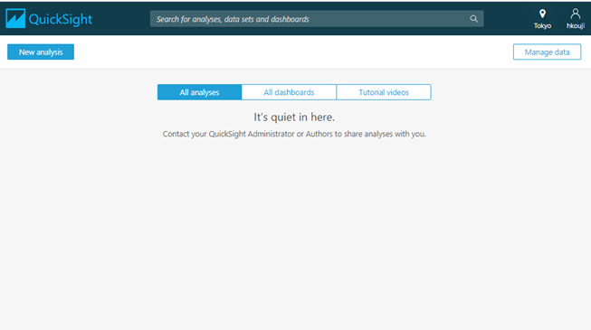

####  4.2 New data set を押してください
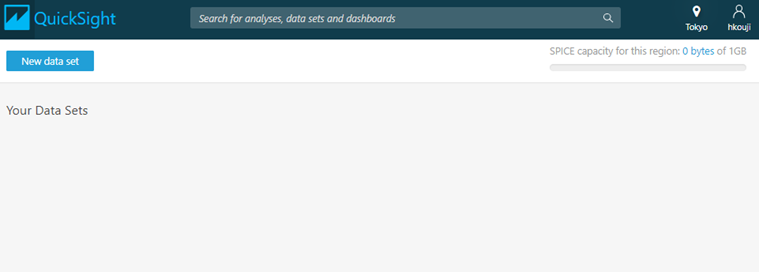

#### 4.3 Redshift Auto-discoverd　を押してください
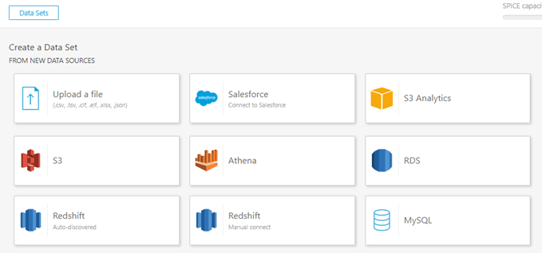

#### 4.4 以下を入力して 「Validate connection」をした後に、「Create data source」を押してください
- Data source name	: 任意の名前 (Handson)
- Instance ID :  プルダウンから選択
- Connection type: Public network
- Database name	: mydb
- Username	: awsuser
- Password	:  CloudFormationで作成時に指定したパスワード

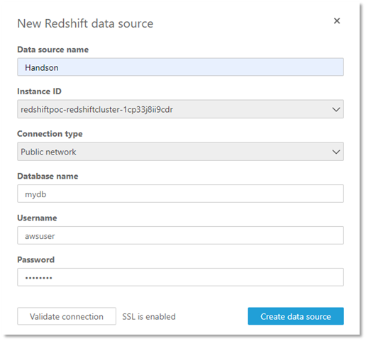

#### 4.5 Sh10 を選んで、Use custom SQLを押してください
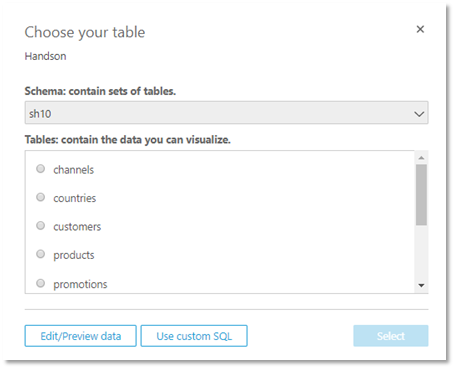


#### 4.6  custom SQL queryを入れる
適当な名前をつける
以下のクエリを [custom SQL query] に貼り付けて [Confirm query] を押す
```
select
  sales.time_id
  , sales.quantity_sold
  , sales.amount_sold
  , products.prod_category
  , products.prod_subcategory
  , channels.channel_desc
  , channels.channel_class
  , promotions.promo_name
  , promotions.promo_category
  , promotions.promo_subcategory
  , times.calendar_year
from
  sh10.sales as sales
  , sh10.products as products
  , sh10.channels as channels
  , sh10.promotions as promotions
  , sh10.times as times
where
  sales.prod_id = products.prod_id
  and sales.channel_id = channels.channel_id
  and sales.promo_id = promotions.promo_id
  and sales.time_id = times.time_id
```

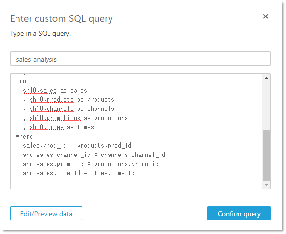

#### 4.7  Direct query your data を選択し、Edit/Preview data 押してください
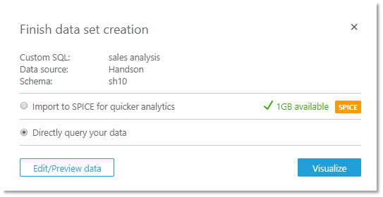

#### 4.8 データが表示されたら，データセットの作成ができました。
Finishを押した後、画面上部の [Save & Visualize] を押して
ダッシュボード作成画面に進む

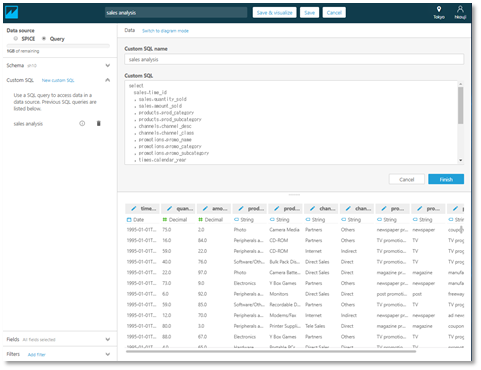

## 5 QuickSight でダッシュボードの作成
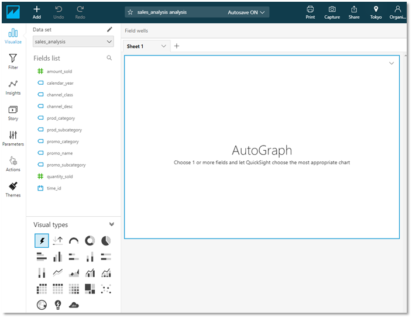

### 5.1  QuickSight でダッシュボードの作成 (1)
KPIを視覚化します
左ペインの [Visual types] 左下のアイコンを選択
[Field list] から amount_sold, time_id の順に選択
グラフの右下をドラッグして，表示サイズを小さくする

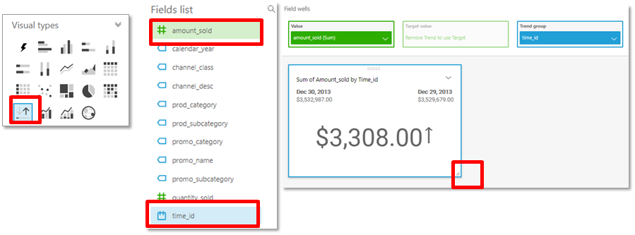

####  時間単位を変えてみる
KPIを日から月の比較に切り替えます
Time_id をクリックすると属性を指定できます。
Monthを選んでみましょう

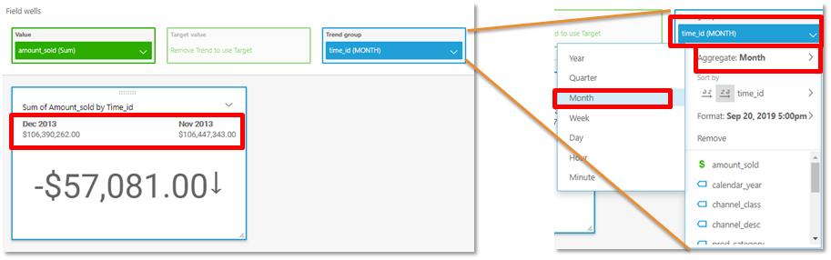

###  5.2  QuickSight でダッシュボードの作成 (2)
画面左上の [+] ボタンを押して [Add visual] を選択
画面左下の棒グラフアイコンを選択
[Field list] から amount_sold, channel_class の順に選択
グラフの大きさを変更し，場所を移動させる

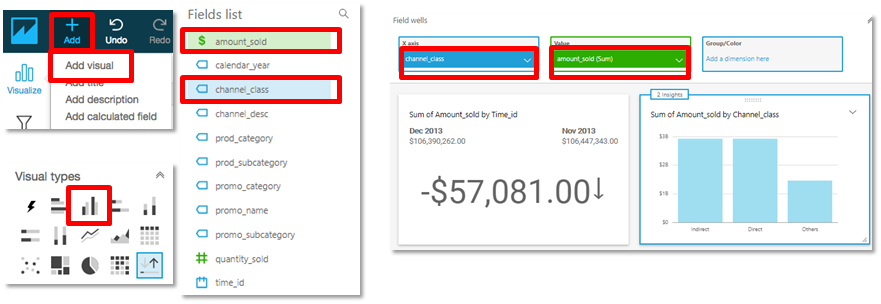


### 5.3 QuickSight でダッシュボードの作成 (3)
画面左上の [+] ボタンを押して [Add visual] を選択
画面左下の棒グラフアイコンを選択
[Field list] から quantity_sold, promo_categoryの順に選択
さらに promo_subcategoryを Y axisにドラック
ドリルダウンレイヤーの追加を選ぶ

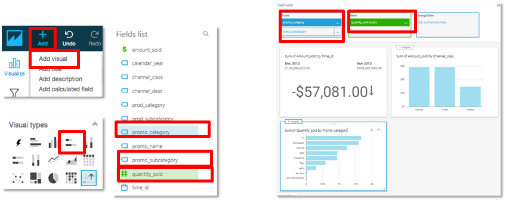

####  ドリルダウンをしてみる
グラフを左クリックするとドロップダウンメニューが表示されます
Drill down to promo_subcategory を選択し、
ドリルダウンをしてみましょう
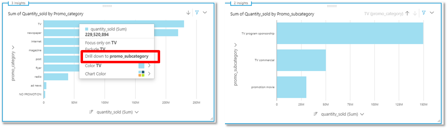

### 5.4 QuickSight でダッシュボードの作成 (4)
画面左上の [+] ボタンを押して [Add visual] を選択
画面左下のピボットテーブルアイコンを選択
[Field list] から amount_sold, Rowsにprod_category, prod_subcategoryの順に選択、Columnsに time_idを選択
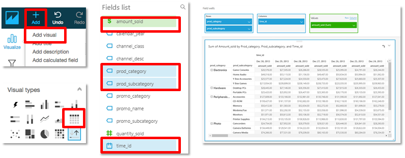


#### 時間単位をかえる
Columns の time_id をクリックし、ドロップダウンメニューから　
Yearを選択し　Sort by を 降順にする
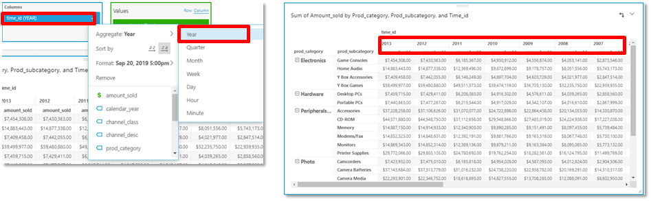


